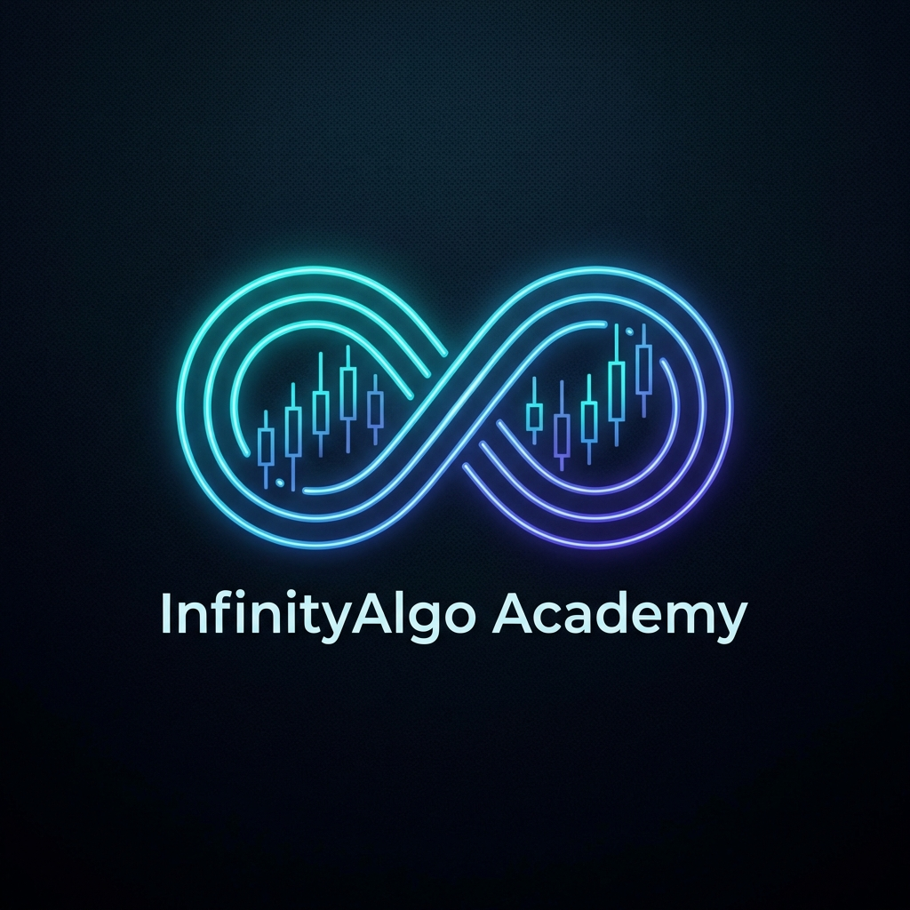

# ♾️ InfinityAlgo Academy - Trade Vantage v4

<p align="center">
  
</p>

<p align="center">
  <strong>The Ultimate Algorithmic Trading Platform for MetaTrader 4</strong>
</p>

<p align="center">
  
  
  
  
</p>

---

## 🚀 About Trade Vantage v4

**Trade Vantage v4** is a high-performance Expert Advisor (EA) developed by **InfinityAlgo Academy**. It represents the pinnacle of algorithmic trading, combining deep price action analysis with real-time momentum tracking and advanced risk management filters.

Designed for professional traders and institutions, v4 brings institutional-grade technology to individual retail traders.

### 🌟 Key Features

- 🧠 **Smart Decision Engine**: Combines Trend Strength (iCustom) with Momentum Buffers (CCI/ATR).
- 🛡️ **Stealth Risk Management**: Features **Virtual Stop-Loss and Take-Profit**. Your exit levels remain hidden from the broker's servers to prevent stop-hunting.
- 📰 **News Avoidance Filter**: Automatically detects high-impact economic events and pauses trading to avoid extreme volatility.
- ⚡ **Slippage Guard**: Prevents entries during periods of high latency or low liquidity.
- 🛡️ **Equity Protection**: Hard-stop functionality that closes all positions if a specific drawdown percentage is reached.
- 📉 **Multi-Timeframe Analysis**: Built-in filters to ensure entries align with higher timeframe trends (H4/D1).

---

## 🛠️ Technical Specifications

| Feature | Specification |
| :--- | :--- |
| **Terminal** | MetaTrader 4 (MT4) |
| **Timeframe** | H1 (Recommended), H4 / M30 (Compatible) |
| **Assets** | EURUSD, GOLD (XAUUSD), BTCUSD, GBPUSD |
| **Min. Balance** | $100 (Cent Account) / $1000 (Standard) |
| **Broker Type** | ECN / STP with low latency (<50ms) |
| **Execution** | Fully Automated |

---

## 📈 Performance Methodology

Trade Vantage v4 underwent rigorous stress testing:
- **Backtesting**: 10+ years of high-quality tick data (99.9% accuracy).
- **Forward Testing**: 6+ months of real-market live execution.
- **Goal**: Focused on a **Profit Factor > 1.5** and stable equity growth.

---

## 🏁 Getting Started

1. **Clone the repository** (if accessing source docs):
   ```bash
   git clone https://github.com/InfinityAlgo-Academy/InfinityAlgo-Academy.github.io.git
   ```
2. **Setup MT4**:
   - Copy `TradeVantage_v4.ex4` to your `MQL4/Experts` folder.
   - Restart MT4.
   - Enable **"Allow Automated Trading"** in Terminal Settings.
3. **Application**:
   - Drag the EA onto the **EURUSD H1** chart.
   - Load the provided `.set` files for optimized performance.

---

## 📘 Documentation

For a deep dive into the technical logic, parameter descriptions, and advanced setup guides, visit our [Technical Documentation](https://infinityalgo-academy.github.io/docs.html).

---

## 🤝 Support & Community

Join our growing community of algorithmic traders:

- **Telegram Support**: [@King_arius_dz](https://t.me/King_arius_dz)
- **Website**: [InfinityAlgo Academy](https://infinityalgo-academy.github.io)

---

## ⚖️ Disclaimer

Trading in the financial markets involves significant risk. Algorithmic trading systems can fail due to technical issues or extreme market conditions. Past performance is not indicative of future results. Always test on a Demo account before using real funds.

---

<p align="center">
  © 2026 InfinityAlgo Academy. All Rights Reserved.
</p>
