# 🚀 Infinity Algo Academy

---

## 📊 About Us

**Infinity Algo Academy** is your premier destination for professional trading tools, algorithms, and educational resources. We specialize in developing cutting-edge trading solutions for MetaTrader, NinjaTrader, and TradingView platforms.

### 🎯 Our Mission
*Empowering traders worldwide with industry-leading knowledge, tools, and AI-powered solutions*

---

## 🌟 Featured Products

<table>
<tr>
<td width="50%">

### 🤖 AI & Automation
- **Mad Turtle AI** - Advanced AI Trading System
- **Expert Quantum Queen MT5** - Intelligent EA
- **AW Recovery EA** - Smart Recovery System
- **Advanced Gold Trading EA** - Specialized Gold Bot

</td>
<td width="50%">

### 📈 Indicators & Tools
- **FTMO Protector PRO** - Risk Management
- **Footprint Price Action Pro** - Market Microstructure
- **DeepTest Indicator** - Advanced Analytics
- **ACD Indicator MT5** - Price Action Tool

</td>
</tr>
</table>

---

## 📚 Repository Showcase

### 🔥 Premium Trading Tools

| Repository | Description | Stars |
|------------|-------------|-------|
| [🛡️ FTMO-Protector-PRO-MT4](https://github.com/InfinityAlgo-Academy/FTMO-Protector-PRO-MT4) | Professional risk management tool for FTMO challenges | ⭐ |
| [📊 Footprint-Price-Action-Pro](https://github.com/InfinityAlgo-Academy/Footprint-Price-Action-Pro) | Advanced market microstructure analysis for NinjaTrader | ⭐⭐⭐⭐ |
| [🐢 Mad-Turtle-AI](https://github.com/InfinityAlgo-Academy/Mad-Turtle-AI) | AI-powered trading system with machine learning | ⭐⭐⭐ |
| [🏠 InfinityAlgo Academy Website](https://github.com/InfinityAlgo-Academy/home) | Official academy website repository | ⭐⭐⭐ |
| [📦 Complete Trading Products Library 2026](https://github.com/InfinityAlgo-Academy/Infinity-Algo-Academy-Complete-Trading-Products-Library-2026-Edition-) | Comprehensive collection of all trading tools | ⭐⭐⭐⭐⭐ |
| [⚡ Expert-Quantum-Queen-MT5](https://github.com/InfinityAlgo-Academy/Expert-Quantum-Queen-MT5-v2.6) | Advanced quantum-based trading expert advisor | ⭐⭐⭐⭐ |
| [🔄 AW-Recovery-EA-MT](https://github.com/InfinityAlgo-Academy/AW-Recovery-EA-MT) | Intelligent recovery expert advisor | ⭐⭐⭐⭐ |
| [🥇 Advanced-Gold-Trading-EA](https://github.com/InfinityAlgo-Academy/Advanced-Gold-Trading-V6.4-EA-MT4-) | Specialized gold trading algorithm v6.4 | ⭐⭐⭐⭐ |

### 🎨 NinjaTrader Indicators

| Repository | Description | Stars |
|------------|-------------|-------|
| [📊 Footprint-Price-Action-Pro-NinjaTrader](https://github.com/InfinityAlgo-Academy/Footprint-Price-Action-Pro-Indicator-for-NinjaTrader) | Professional footprint analysis tool | ⭐⭐⭐⭐ |
| [💹 Footprint-Orderflow-NinjaTrader](https://github.com/InfinityAlgo-Academy/Footprint-Orderflow-Indicator-for-NinjaTrader) | Advanced order flow analysis | ⭐⭐⭐⭐ |

### 📈 TradingView & MetaTrader

| Repository | Description | Stars |
|------------|-------------|-------|
| [🔬 DeepTest-TradingView](https://github.com/InfinityAlgo-Academy/DeepTest-TradingView-Indicator-Free-Download) | Advanced backtesting indicator - Free Download | ⭐⭐⭐ |
| [🔍 Arbitrage-Detector-LuxAlgo](https://github.com/InfinityAlgo-Academy/Arbitrage-Detector-LuxAlgo-Free-Download) | LuxAlgo arbitrage detection tool - Free | ⭐⭐⭐ |
| [📊 ACD-Indicator-MT5](https://github.com/InfinityAlgo-Academy/ACD-Indicator-for-MetaTrader-5) | Advanced price action indicator for MT5 | ⭐⭐⭐ |
| [📊 ACD-Indicator-MT5-Enhanced](https://github.com/InfinityAlgo-Academy/ACD-Indicator-for-MetaTrader-5-) | Enhanced version with additional features | ⭐⭐⭐⭐ |

### 🛠️ Development & Tools

| Repository | Description | Stars |
|------------|-------------|-------|
| [📚 Complete-Professional-Trading-Tools](https://github.com/InfinityAlgo-Academy/Complete-Professional-Trading-Tools-Algorithms-Library) | Professional algorithms library | ⭐⭐⭐⭐ |
| [⚡ BoltNew](https://github.com/InfinityAlgo-Academy/BoltNew) | Modern development framework | ⭐⭐⭐⭐ |
| [🌐 InfinityAlgoV3](https://github.com/InfinityAlgo-Academy/InfinityAlgoV3) | Latest version of core algorithm | ⭐⭐⭐⭐⭐ |
| [🔧 n8n](https://github.com/InfinityAlgo-Academy/n8n) | Workflow automation platform | ⭐⭐⭐⭐ |

### 🤖 AI & Automation Tools

| Repository | Description | Stars |
|------------|-------------|-------|
| [🌐 InfinityDomainOracle](https://github.com/InfinityAlgo-Academy/InfinityDomainOracle) | منصة استخباراتية متقدمة لتحليل الدومينات بالذكاء الاصطناعي | ⭐⭐⭐⭐ |
| [✍️ AI-Writy](https://github.com/InfinityAlgo-Academy/AI-Writy) | AI-Powered content creation & digital marketing | ⭐⭐⭐⭐ |
| [🔍 awesome-seo-tools](https://github.com/InfinityAlgo-Academy/awesome-seo-tools) | Curated list of awesome SEO tools | ⭐⭐⭐⭐ |
| [🎯 CL4R1T4S](https://github.com/InfinityAlgo-Academy/CL4R1T4S) | AI systems transparency & leaked prompts | ⭐⭐⭐⭐ |
| [💻 cursor-pro-free](https://github.com/InfinityAlgo-Academy/cursor-pro-free) | Free Cursor Pro features | ⭐⭐⭐⭐⭐ |
| [⚡ cursor-free-vip](https://github.com/InfinityAlgo-Academy/cursor-free-vip) | VIP Cursor features unlocked | ⭐⭐⭐ |

### 📖 Resources & Documentation

| Repository | Description | Stars |
|------------|-------------|-------|
| [🔫 king-arius-gun-relay](https://github.com/InfinityAlgo-Academy/king-arius-gun-relay) | Gun relay system implementation | ⭐⭐⭐⭐ |
| [📝 claude-code-templates](https://github.com/InfinityAlgo-Academy/claude-code-templates-tab-readme-ov-file) | Claude AI code templates collection | ⭐⭐⭐⭐ |
| [🎨 gpt4o-image-prompts](https://github.com/InfinityAlgo-Academy/gpt4o-image-prompts) | GPT-4o image generation prompts | ⭐⭐⭐⭐ |
| [💾 dexie-website](https://github.com/InfinityAlgo-Academy/dexie-website) | Dexie.js website resources | ⭐⭐⭐⭐ |
| [👥 fluent-community](https://github.com/InfinityAlgo-Academy/fluent-community) | Community management platform | ⭐⭐⭐⭐ |
| [📚 fluent-community-docs](https://github.com/InfinityAlgo-Academy/luent-community-docs) | Community documentation | ⭐⭐⭐⭐ |

---

## 🎓 What We Offer

```mermaid
graph LR
    A[🎯 Trading Education] --> B[📊 Professional Tools]
    B --> C[🤖 AI Solutions]
    C --> D[👥 Community Support]
    D --> E[🚀 Success]
    
    style A fill:#00D9FF,stroke:#0099CC,stroke-width:2px,color:#000
    style B fill:#FF6B6B,stroke:#CC5555,stroke-width:2px,color:#000
    style C fill:#4ECDC4,stroke:#3DA39D,stroke-width:2px,color:#000
    style D fill:#FFE66D,stroke:#CDB856,stroke-width:2px,color:#000
    style E fill:#95E1D3,stroke:#77B4A9,stroke-width:2px,color:#000
```

<table>
<tr>
<td width="33%" align="center">

### 📚 Education
Comprehensive trading courses and tutorials for all skill levels

</td>
<td width="33%" align="center">

### 🛠️ Tools
Professional-grade indicators, EAs, and trading systems

</td>
<td width="33%" align="center">

### 🤝 Support
Active community and dedicated customer support

</td>
</tr>
</table>

---

## 📞 Contact Information

### 💬 Get In Touch

<table>
<tr>
<td align="center">

**🌐 Website**  
[infinityalgoacademy.net](https://infinityalgoacademy.net)

</td>
<td align="center">

**👥 Community**  
[Join Our Community](https://infinityalgoacademy.net/community)

</td>
<td align="center">

**🛒 Shop**  
[Browse Products](https://infinityalgoacademy.net/shop)

</td>
</tr>
<tr>
<td align="center">

**💬 Telegram**  
[@InfinityAlgo_Group_Topics](https://t.me/InfinityAlgo_Group_Topics)

</td>
<td align="center">

**📱 Contact**  
[@King_arius_dz](https://t.me/King_arius_dz)

</td>
<td align="center">

**📧 Email**  
[me@infinityalgoacademy.net](mailto:me@infinityalgoacademy.net)

</td>
</tr>
<tr>
<td colspan="3" align="center">

**📞 Phone**  
[+213 795 97 57 12](tel:+213795975712)

</td>
</tr>
</table>

---

## 📊 GitHub Statistics

---

## 🏆 Our Achievements

---

## 🌐 Platforms We Support

| Platform | Tools Available | Status |
|----------|----------------|--------|
| 📊 **MetaTrader 4** | Expert Advisors, Indicators | ✅ Active |
| 📈 **MetaTrader 5** | Expert Advisors, Indicators | ✅ Active |
| 🎯 **NinjaTrader** | Indicators, Strategies | ✅ Active |
| 📉 **TradingView** | Pine Script Indicators | ✅ Active |
| 🤖 **AI Solutions** | Custom Algorithms | ✅ Active |

---

## 💎 Why Choose Infinity Algo Academy?

| Feature | Description |
|---------|-------------|
| ✅ **Professional Quality** | Industry-leading tools developed by expert traders |
| ✅ **Continuous Updates** | Regular updates and improvements to all products |
| ✅ **24/7 Support** | Dedicated support team ready to help |
| ✅ **Active Community** | Join thousands of successful traders |
| ✅ **Educational Resources** | Comprehensive learning materials |
| ✅ **Affordable Pricing** | Premium quality at competitive prices |

---

## 🚀 Quick Links

---

## 📜 License & Terms

All products and tools are protected by copyright and licensed for use according to our terms of service.  
Please visit our [website](https://infinityalgoacademy.net) for detailed licensing information.

---

### 🌟 Star Our Repositories!

If you find our tools helpful, please consider giving us a ⭐ on GitHub!

---

**© 2026 Infinity Algo Academy. All Rights Reserved.**

*Empowering Traders Worldwide* 🚀

